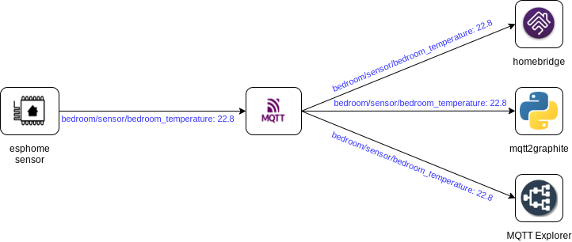

# MQTT

MQTT is the core infrastructure you will build your IoT-FS around. It is a lightweight message transport that you will both read from and publish to. Clients connect to the MQTT server to send and/or receive messages from other clients connected to the same server.

When a client sends a message to MQTT it contains two important pieces of information, the `topic` and the `payload`. In the diagram below we show a temperature sensor publishing a reading. The topic is the `bedroom/sensor/bedroom_temperature` part, while the payload is `22.8`. The clients on the right have subscribed to the topic for this sensor and as such will receive a copy of the message.

# MQTT Topics

The topic is how the MQTT server routes messages. Clients subscribe to one or more topics and the MQTT server routes all matching messages to those clients. Topics are similar to file paths, they are slash (`/`) separated strings that indicate unique resources. Here are some examples of topics I see on my MQTT server:

* `homeassistant/binary_sensor/Kitchen-FrontdoorDetector/contact/config`
* `weather/daily/0/temp/day_C`
* `rtl_433/7b85b6eafe6d/devices/Acurite-Tower/A/9181/temperature_C`
* `zwave/Kitchen/FrontdoorDetector/113/0/Access_Control/Door_state`

As you can see there is a structure to MQTT topics, but that structure is not always well defined.

## Wildcards

When subscribing to MQTT topics the client can utilize wildcards. This allows the client to subscribe to multiple topics easily, or even to listen on every topic. The available wildcards are:

* `+`: Similar to the `*` wildcard in shell, this matches any string contained between topic parts (Denoted by the slash (`/`) character.)
* `#`: This is similar to `+`, but it will match against all following topic parts as well.

Some examples:

* `+/sensor/+`: Subscribe to all of the esphome sensors, which are always in the format `<room>/sensor/<room>_<sensor>`
* `homeassistant/#`: Subscribe to the [Home Assistant MQTT Discovery](https://www.home-assistant.io/docs/mqtt/discovery/) topics
* `#`: Subscribe to everything

# MQTT Payloads

To the MQTT server a payload is just an array of bytes. It delivers this payload exactly as it was received, it's up to the client to correctly decode the payload. In practice payloads are almost always ASCII or UTF-8 encoded text, even when dealing with numeric data.

(Note: In MQTT 5 there is new metadata to indicate the payload's format and content type. We are focusing on MQTT 3 for now as it is the most widely-deployed protocol.)

Some applications use single-value payloads. These payloads are typically strings or simple ints or floats encoded as strings. Some applications encode their payload using JSON to allow for more complex data to be sent. Neither pattern is right or wrong, they simply grew out of the requirements of the application.

# Quality Of Service

Messages sent to MQTT are (usually) delivered to clients in the order they are received. If your connection to the server is stable they will always be in order. If your connection is not stable it will depend on the Quality Of Service (QOS) level set:

* `QOS=0`: the message may not get delivered
* `QOS=1`: the message may get delivered more than once
* `QOS=2`: the message will get delivered exactly once

It's not important to understand the difference between these right now, it's enough to know that you can choose the level of reliability to match your application's needs.

# MQTT Standards

As you can tell MQTT allows for a broad range of usage patterns. There have been two attempts to standardize these patterns that are worth your time to read:

* [mqtt-smarthome](https://github.com/mqtt-smarthome/mqtt-smarthome)
* [The Homie Convention](https://github.com/homieiot/convention) 

As you read these keep in mind that neither standard has been widely adopted.
